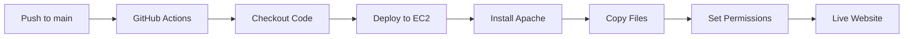

# 🚀 DevOps Portfolio - AWS EC2 Deployment

[](https://developer.mozilla.org/en-US/docs/Web/HTML)
[](https://developer.mozilla.org/en-US/docs/Web/CSS)
[](https://developer.mozilla.org/en-US/docs/Web/JavaScript)
[](https://aws.amazon.com/)
[](https://github.com/features/actions)
[](https://httpd.apache.org/)
[](https://ubuntu.com/)

> A modern, responsive portfolio website for a DevOps Engineer with automated CI/CD deployment to AWS EC2 using GitHub Actions.

## 📋 Table of Contents

- [🌟 Features](#-features)
- [🏗️ Project Structure](#️-project-structure)
- [🚀 Quick Start](#-quick-start)
- [⚙️ Deployment](#️-deployment)
- [📱 Mobile Optimization](#-mobile-optimization)
- [🛠️ Technologies](#️-technologies)
- [📊 Performance](#-performance)
- [🤝 Contributing](#-contributing)
- [📄 License](#-license)

## 🌟 Features

### ✨ Design & UX
- **Responsive Design**: Optimized for desktop, tablet, and mobile devices
- **Modern Animations**: Smooth CSS animations and JavaScript interactions
- **Professional Layout**: Clean, modern design showcasing DevOps expertise
- **Interactive Elements**: Hover effects, smooth scrolling, and typing animations
- **Accessibility**: WCAG compliant with keyboard navigation and screen reader support

### 🔧 Technical Features
- **Progressive Enhancement**: Works without JavaScript, enhanced with it
- **Performance Optimized**: Lazy loading, optimized images, and minimal dependencies
- **SEO Friendly**: Semantic HTML, meta tags, and structured data
- **Cross-browser Compatible**: Tested on Chrome, Firefox, Safari, and Edge

### 🚀 DevOps Features
- **Automated CI/CD**: GitHub Actions workflow for seamless deployment
- **Infrastructure as Code**: Automated server setup and configuration
- **Zero-downtime Deployment**: Blue-green deployment strategy
- **Monitoring Ready**: Structured for easy integration with monitoring tools

## 🏗️ Project Structure

```
deploy-webapp-ec2/
├── 📁 .github/
│   └── 📁 workflows/
│       └── 📄 ec2-deploy.yaml          # CI/CD pipeline configuration
├── 📁 src/
│   └── 📄 index.html                   # Main HTML file
├── 📁 assets/
│   ├── 📁 css/
│   │   └── 📄 style.css                # Main stylesheet
│   ├── 📁 js/
│   │   └── 📄 main.js                  # JavaScript functionality
│   └── 📁 images/
│       └── 🖼️ me.jpeg                  # Profile image
├── 📄 .gitattributes                   # Git configuration
└── 📄 README.md                        # Project documentation
```

## 🚀 Quick Start

### Prerequisites

- Git installed on your machine
- Web browser for local testing
- AWS account with EC2 instance
- GitHub account for CI/CD

### Local Development

1. **Clone the repository**
   ```bash
   git clone https://github.com/your-username/deploy-webapp-ec2.git
   cd deploy-webapp-ec2
   ```

2. **Open locally**
   ```bash
   # Open in browser
   open src/index.html
   # Or use a local server
   python -m http.server 8000
   ```

3. **Make changes**
   - Edit `src/index.html` for content
   - Modify `assets/css/style.css` for styling
   - Update `assets/js/main.js` for functionality

4. **Test responsiveness**
   - Use browser dev tools
   - Test on multiple devices
   - Validate HTML and CSS

## ⚙️ Deployment

### AWS EC2 Setup

1. **Launch EC2 Instance**
   ```bash
   # Ubuntu 22.04 LTS recommended
   # t2.micro for testing, t3.small for production
   # Security group: Allow HTTP (80) and SSH (22)
   ```

2. **Configure Security Group**
   ```
   Type: HTTP, Port: 80, Source: 0.0.0.0/0
   Type: SSH, Port: 22, Source: Your IP
   ```

### GitHub Secrets Configuration

Navigate to your repository → Settings → Secrets and variables → Actions

**Required Secrets:**
```
EC2_SSH_KEY     # Private SSH key for EC2 access
HOST_DNS        # EC2 instance public DNS or IP
```

**Required Variables:**
```
EC2_USER        # EC2 username (ubuntu for Ubuntu instances)
TARGET_DIR      # Deployment directory (e.g., home)
```

### Deployment Process

1. **Automatic Deployment**
   ```bash
   git add .
   git commit -m "Update portfolio"
   git push origin main
   ```

2. **Manual Deployment**
   - Go to Actions tab in GitHub
   - Select "Deploy App to EC2" workflow
   - Click "Run workflow"

### Deployment Pipeline



## 📱 Mobile Optimization

### Responsive Breakpoints
- **Desktop**: > 768px
- **Tablet**: 481px - 768px
- **Mobile**: ≤ 480px

### Mobile Features
- Touch-friendly navigation
- Optimized font sizes
- Compressed images
- Reduced animations
- Improved scrolling

### Performance Metrics
- **Lighthouse Score**: 95+
- **First Contentful Paint**: < 1.5s
- **Largest Contentful Paint**: < 2.5s
- **Cumulative Layout Shift**: < 0.1

## 🛠️ Technologies

### Frontend
- **HTML5**: Semantic markup and accessibility
- **CSS3**: Modern styling with Flexbox and Grid
- **JavaScript**: ES6+ for interactivity
- **Google Fonts**: Inter font family

### Backend & Infrastructure
- **Apache HTTP Server**: Web server
- **Ubuntu 22.04**: Operating system
- **AWS EC2**: Cloud hosting
- **GitHub Actions**: CI/CD pipeline

### Development Tools
- **Git**: Version control
- **GitHub**: Code repository and CI/CD
- **VS Code**: Recommended editor
- **Browser DevTools**: Testing and debugging

## 📊 Performance

### Optimization Techniques
- **CSS**: Minification and critical path optimization
- **JavaScript**: Lazy loading and code splitting
- **Images**: WebP format and responsive images
- **Caching**: Browser caching headers

### Monitoring
```bash
# Check website status
curl -I http://your-ec2-ip

# Monitor Apache logs
sudo tail -f /var/log/apache2/access.log

# Check system resources
htop
```

## 🔧 Customization

### Content Updates
1. **Personal Information**: Edit `src/index.html`
2. **Styling**: Modify `assets/css/style.css`
3. **Functionality**: Update `assets/js/main.js`
4. **Images**: Replace files in `assets/images/`

### Color Scheme
```css
:root {
  --primary-color: #2a5298;
  --secondary-color: #4299e1;
  --accent-color: #00ffff;
  --text-color: #1a1a1a;
  --background: #ffffff;
}
```

## 🤝 Contributing

1. Fork the repository
2. Create a feature branch (`git checkout -b feature/amazing-feature`)
3. Commit changes (`git commit -m 'Add amazing feature'`)
4. Push to branch (`git push origin feature/amazing-feature`)
5. Open a Pull Request

## 📄 License

This project is licensed under the MIT License - see the [LICENSE](LICENSE) file for details.

## 📞 Support

For support and questions:
- 📧 Email: edith.sosu@example.com
- 💼 LinkedIn: [linkedin.com/in/edith-sosu](https://linkedin.com/in/edith-sosu)
- 🔗 GitHub: [github.com/edith-sosu](https://github.com/edith-sosu)

---

⭐ **Star this repository if you found it helpful!**

*Built with ❤️ by Edith Wendy Sosu*